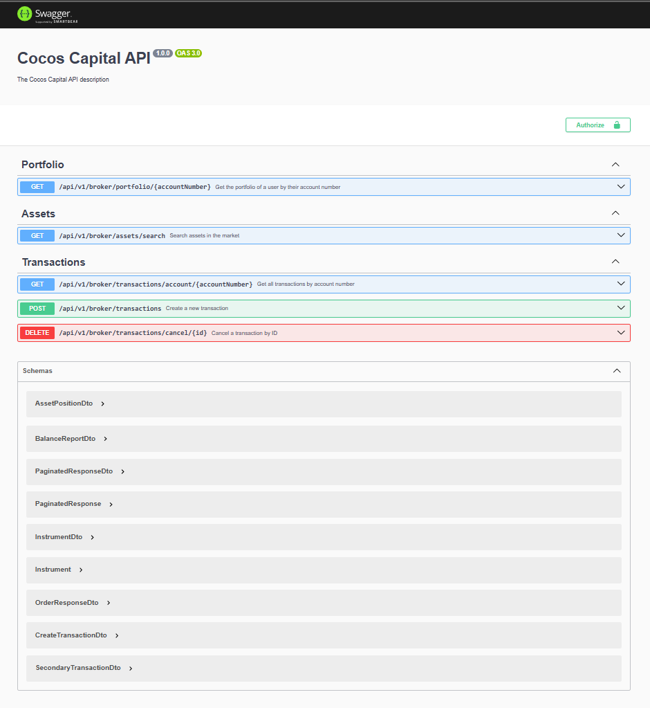

# COCOS CAPITAL BACKEND API

<p align="center">
  <a href="https://cocos.capital/" target="_blank">
    
  </a> &nbsp; &nbsp;
  <a href="http://nestjs.com/" target="_blank">
    
  </a>
</p>


## Instrucciones de Instalación

### 1. Clonar el repositorio

```bash
git clone https://github.com/cucchi10/cocos-challenge-backend.git
cd cocos-challenge-backend
```
---

### 2. Instalar las dependencias
Asegúrate de tener instalado Node.js (V20.x o superior) y npm o yarn.

```bash
npm install
```
---

### 3. Configuración de la base de datos

Aquí tienes una guía detallada en [`/docs/docker-compose/database-init.tutorial.md`](/docs/docker-compose/database-init.tutorial.md) con toda la información sobre la instalación y configuración de la base de datos en Docker. 🚀

#### 3.1. PostgreSQL y PG Admin
Para levantar la base de datos con PostgreSQL y PG Admin, puedes usar el archivo `docker-compose.yml` que se encuentra en la raíz del proyecto.

#### 3.2. Levantar los servicios de Docker
En la raíz del proyecto, ejecuta el siguiente comando para iniciar los contenedores de la base de datos y PG Admin:


```bash
docker-compose up -d
```

#### 3.3. Acceso a PG Admin
Accede a PG Admin en `http://localhost:8080` utilizando las credenciales por defecto:

```yml
Email: test@example.com

Contraseña: 123456
```

Dentro de PG Admin, conecta a la base de datos utilizando el host db y las credenciales definidas en `docker-compose.yml`.

📄 Documentación relacionada: Puedes encontrar más detalles sobre los cambios en el esquema de la base de datos en `/docs/database/database-schema-changes.md`.

---

### 4. Iniciar la API

Antes de iniciar el servidor, necesitas configurar el archivo de variables de entorno `.env`:

#### 4.1. Copia el archivo `.env.example` a `.env`:

```bash
cp .env.example .env
```
#### 4.2. Abre el archivo .env y ajusta las variables de entorno necesarias, como la configuración de la base de datos, puertos, etc.

Después de configurar el archivo .env, puedes iniciar el servidor de la API:

```bash
npm run start:dev
```

Esto levantará el servidor en el puerto `3000` (por defecto). La API estará disponible en `http://localhost:3000`.

---

### Swagger UI
La documentación de la API está disponible a través de Swagger UI. Para acceder a ella, simplemente visita:

```bash
http://localhost:3000/api/v1/doc
```


---

## Archivos adicionales

* `Base de datos`: Para ver los cambios realizados al modelo de la base de datos, consulta el archivo [`/docs/database/database-schema-changes.md`]( /docs/database/database-schema-changes.md).

* `Docker Compose`: El archivo docker-compose.yml se encuentra en la raíz del proyecto, y puedes ver la documentación relacionada en [`/docs/docker-compose/database-init.tutorial.md`](/docs/docker-compose/database-init.tutorial.md).

* `Colección de Postman`: Puedes encontrar una colección básica con ejemplos de la API en [`/docs/postman`](/docs/postman).

---

## Notas adicionales
Si tienes alguna duda sobre el proyecto, la estructura de la base de datos o cualquier otro aspecto técnico, por favor revisa los archivos en la carpeta `/docs`.

Asegúrate de que los servicios de Docker estén corriendo antes de interactuar con la API.

---

## License

Nest is [MIT licensed](https://github.com/nestjs/nest/blob/master/LICENSE).